

  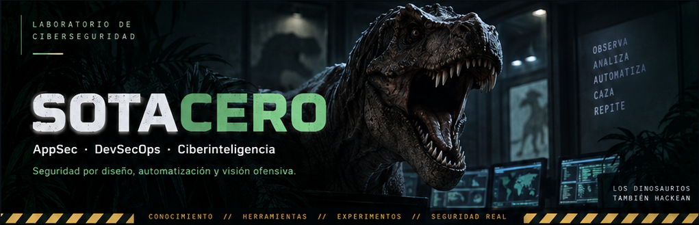

<h2> Perfil</h2>

<table>
  <tr>
    <td width="74%" valign="top">
      
Soy <strong>Luismi</strong>. Trabajo en seguridad de aplicaciones, gestión de vulnerabilidades y automatización de controles (entre otras muchas cosas).

      
Este es mi laboratorio personal: un espacio para compartir proyectos, notas, herramientas y experimentos relacionados con ciberseguridad.

      <blockquote>
        
<strong>«La vida siempre se abre camino».</strong> — Ian Malcolm

      </blockquote>
      
<em>Las vulnerabilidades también. Mejor encontrarlas antes.</em>

    </td>
    <td width="26%" align="center" valign="middle">
      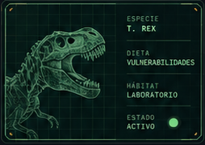
    </td>
  </tr>
</table>

<h2> Proyectos destacados</h2>

// EXPERIMENTOS EN LIBERTAD CONTROLADA

<table>
  <tr>
    <td width="33%" valign="top">
      <h3><a href="https://github.com/Sotacero/KEV-Viewer">KEV-Viewer</a></h3>
      
<strong>Vulnerabilidades&nbsp;explotadas</strong>

      
Visor del catálogo KEV de CISA, con búsqueda por CVE y filtrado por vinculación con campañas de ransomware.

      
<code>Python</code> <code>JavaScript</code> <code>CISA KEV</code>

      
<a href="https://github.com/Sotacero/KEV-Viewer">Ver en GitHub →</a>

    </td>
    <td width="33%" valign="top">
      <h3><a href="https://github.com/Sotacero/Pandita">Pandita</a></h3>
      
<strong>Análisis&nbsp;de&nbsp;registros&nbsp;por&nbsp;BIN</strong>

      
Aplicación de escritorio para filtrar registros de tarjetas por BIN en archivos de texto y eliminar resultados duplicados.

      
<code>Python</code> <code>Tkinter</code> <code>Análisis de datos</code>

      
<a href="https://github.com/Sotacero/Pandita">Ver en GitHub →</a>

    </td>
    <td width="34%" valign="top">
      <h3><a href="https://www.lincesec.com">LINCESEC</a></h3>
      
<strong>Protección&nbsp;de&nbsp;riesgos&nbsp;digitales</strong>

      
Plataforma en desarrollo para monitorización de marca, exposición externa y ciberinteligencia, con búsqueda y análisis automatizados.

      
<code>DRP</code> <code>OSINT</code> <code>Automatización</code>

      
<a href="https://www.lincesec.com">Visitar la web →</a>

    </td>
  </tr>
</table>

<h2> Arsenal tecnológico</h2>

  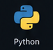
  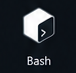
  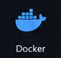
  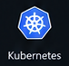
  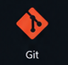
  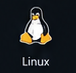
  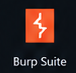
  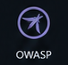
  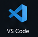
  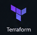
  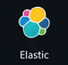

<table>
  <tr>
    <td width="52%" valign="top">
      <h3>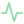 Actividad&nbsp;reciente</h3>
      
// ÚLTIMAS OPERACIONES PÚBLICAS

      <!-- ACTIVITY:START -->
      
La actividad pública se cargará con la primera ejecución del workflow.

      <!-- ACTIVITY:END -->
      
<a href="https://github.com/Sotacero?tab=overview">Ver actividad en GitHub →</a>

    </td>
    <td width="48%" valign="top">
      <h3> Sala&nbsp;de&nbsp;control</h3>
      
// ESTADO DEL SISTEMA

      <!-- Panel temático estático; no representa comprobaciones de disponibilidad. -->
      
      
 Laboratorio &nbsp;&nbsp;&nbsp; <code>ONLINE</code>

      
 Cazador de bugs &nbsp;&nbsp;&nbsp; <code>ACTIVO</code>

      
 Dinosaurios &nbsp;&nbsp;&nbsp; <code>SIEMPRE</code>

      

      
<strong>UN INTERNET MÁS SEGURO</strong> OBSERVA · ANALIZA · MEJORA

    </td>
  </tr>
</table>

---

  <a href="https://linkedin.com/in/luismicalderon">LinkedIn</a>
  &nbsp;·&nbsp;
  <a href="mailto:lmcalderon_job@outlook.es">Email</a>
  &nbsp;·&nbsp;
  <a href="https://www.lincesec.com">LINCESEC</a>

GRACIAS POR PASAR POR AQUÍ BUILDER · BREAKER · LEARNER · SOTACERO

<!-- ↑ ↑ ↓ ↓ ← → ← → B A -->
