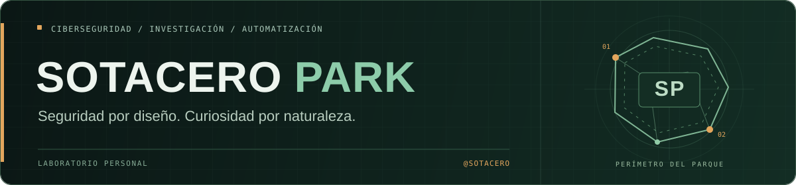

<p align="center">
  
</p>

<h1 align="center">Luis Miguel Calderón · Sotacero</h1>

<p align="center">
  <strong>AppSec · ASPM · DevSecOps · Ciberinteligencia</strong>
</p>

<p align="center">
  <a href="https://linkedin.com/in/luismicalderon">LinkedIn</a>
  &nbsp;·&nbsp;
  <a href="mailto:lmcalderon_job@outlook.es">Email</a>
  &nbsp;·&nbsp;
  <a href="https://www.lincesec.com">LINCESEC</a>
</p>

## Sobre mí

Soy **Luismi**, especialista en ciberseguridad. Trabajo en seguridad de aplicaciones, gestión de vulnerabilidades e integración de controles en el ciclo de desarrollo.

Me gusta construir herramientas que resuelvan problemas concretos: automatizar análisis, conectar fuentes de información y convertir hallazgos en algo que se pueda investigar y corregir. Aquí comparto proyectos, experimentos y parte de ese trabajo.

> La seguridad no consiste solo en levantar cercas: también hay que entender qué ocurre a ambos lados.

## Áreas de trabajo

| Área | En qué me centro |
| :--- | :--- |
| **AppSec y ASPM** | Evaluación y priorización de vulnerabilidades, contexto de aplicación y seguimiento de la remediación. |
| **DevSecOps y automatización** | Integración de seguridad en CI/CD, controles en pipelines y automatización mediante scripts y APIs. |
| **Ciberinteligencia y DRP** | OSINT, protección de marca, exposición externa y análisis de posibles filtraciones y amenazas. |

## Proyectos · Expediciones en marcha

<table>
  <tr>
    <td width="50%" valign="top">
      <h3><a href="https://www.lincesec.com">LINCESEC</a></h3>
      <p><strong>Protección de riesgos digitales</strong></p>
      <p>Trabajo en el desarrollo de una plataforma de monitorización de marca, exposición externa y ciberinteligencia, con motores de búsqueda y flujos de análisis automatizados.</p>
      <p><code>DRP</code> <code>OSINT</code> <code>Automatización</code></p>
      <p><a href="https://www.lincesec.com">Visitar la web →</a></p>
    </td>
    <td width="50%" valign="top">
      <h3><a href="https://github.com/Sotacero/KEV-Viewer">KEV-Viewer</a></h3>
      <p><strong>Vulnerabilidades explotadas</strong></p>
      <p>Visor del catálogo KEV de CISA con búsqueda por CVE y filtrado por vinculación con campañas de ransomware. Una forma directa de consultar y explorar sus registros.</p>
      <p><code>Python</code> <code>JavaScript</code> <code>CISA KEV</code></p>
      <p><a href="https://github.com/Sotacero/KEV-Viewer">Explorar el repositorio →</a></p>
    </td>
  </tr>
</table>

### [Pandita](https://github.com/Sotacero/Pandita)

Aplicación de escritorio en **Python y Tkinter** para filtrar registros de tarjetas por BIN en ficheros de texto y eliminar resultados duplicados.

`Python` `Tkinter` `Procesamiento de ficheros`

## Stack · Herramientas de campo

**Desarrollo e integraciones**  
`Python` `JavaScript` `HTML` `CSS` `REST APIs` `GraphQL`

**Automatización y entorno**  
`Azure DevOps` `Git` `Linux` `n8n`

**Datos**  
`MySQL` `SQLite`

---

<details>
  <summary><strong>🦖 Sala de control · Terminal Hammond</strong></summary>

<br />

<p align="center">
  
</p>

```text
hammond@sotacero-park:~$ ./check-perimeter

[OK] Laboratorio preparado
[OK] Curiosidad intacta
[!!] No confiar toda la seguridad a las cercas

> access main security grid
> Ah, ah, ah... no has dicho la palabra mágica.
```

> «La vida siempre se abre camino».

Las vulnerabilidades también. Mejor encontrarlas antes.

</details>

<!-- Easter egg: ↑ ↑ ↓ ↓ ← → ← → B A -->
